# F21GA - Interaction

## Contents

- [Basic Interaction and Hotkey guide](#basic-interaction-and-hotkey-guide)

- [Model Exporting and Importing](#model-exporting-and-importing)

- [Scene Setup](#scene-setup)

    - [Model loading](#model-loading)
    - [Model placement](#model-placement)
    - [Light placement](#light-placement)

- [Shaders and Lighting](#shaders-and-lighting)

    - [Phong lighting model](#phong-lighting-model)
    - [Attenuation](#attenuation)
    - [Shadows](#shadows)
    - [Multiple lights and shadows](#multiple-lights-and-shadows)

- [Additional Effects](#additional-effects)

- [Interaction](#interaction)
    
    - [Camera](#camera)
    - [Keyboard](#keyboard)
    - [UI](#ui)

- [Animations](#animations)

    - [Toast Popping](#toast-popping)

- [References](#references)


## Basic Interaction and Hotkey Guide

Mouse movement : Move camera / view

| Key | Effect |
| --- | --- |
| `W` | Move forward |
| `S` | Move backward |
| `A` | Move left |
| `D` | Move right |
| `Q` | Move Up (NoClip enabled) |
| `E` | Move Down (NoClip enabled) |
| `Tab` | Toggle mouse lock to window |
| `C` | Toggle UI (Off by default) |
| `Z` | Toggle NoClip |
| `X` | Toggle Wireframe |
| `F` | Sun on/off |
| `V` | Ceiling lights on/off |
| `R` | Reset selected object position |
| `Z` | Toggle NoClip |
| `,` | Change selected object (Object ID shown in bottom right info box) |
| `.` | Change selected object (Object ID shown in bottom right info box) |
| `H` | Move selected object left relative to the camera |
| `K` | Move selected object right relative to the camera |
| `U` | Move selected object forward relative to the camera |
| `J` | Move selected object back relative to the camera |
| `Y` | Move selected object down |
| `I` | Move selected object up|
| `O` | Increase move selected object sensitivity |
| `L` | Decrease move selected object sensitivity |
| `Left` | Rotate selected object |
| `Right` | Rotate selected object |
| `Up` | Rotate selected object |
| `Down` | Rotate selected object |


<br /><br />

## Model Exporting and Importing


The basic steps to import most of the models are as follows.

First, if there are any overlapping faces that may result in "Z-fighting", they are reduced to one face. Then, if there is any complex geometry, particularly geometry that is not triangles or quads, a triangle modifier is applied.

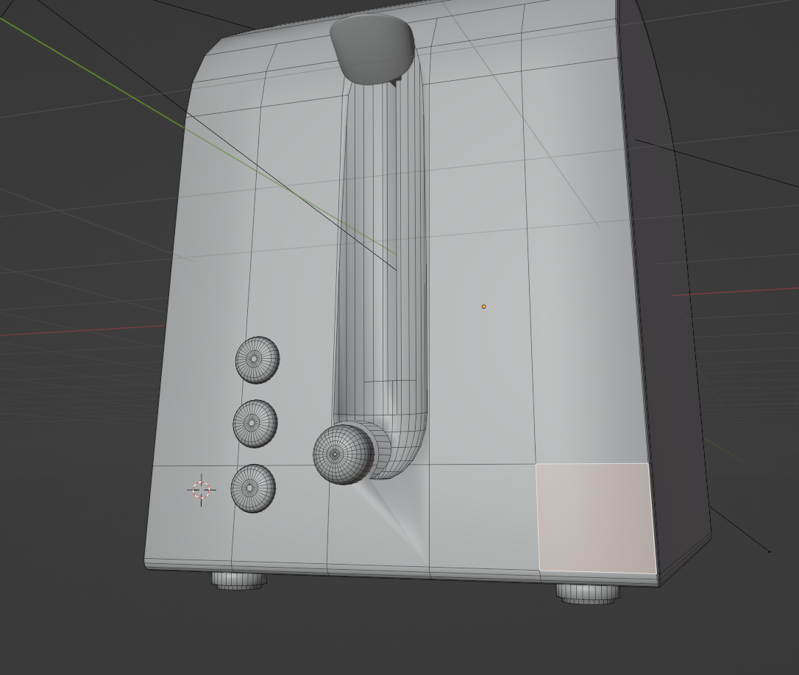 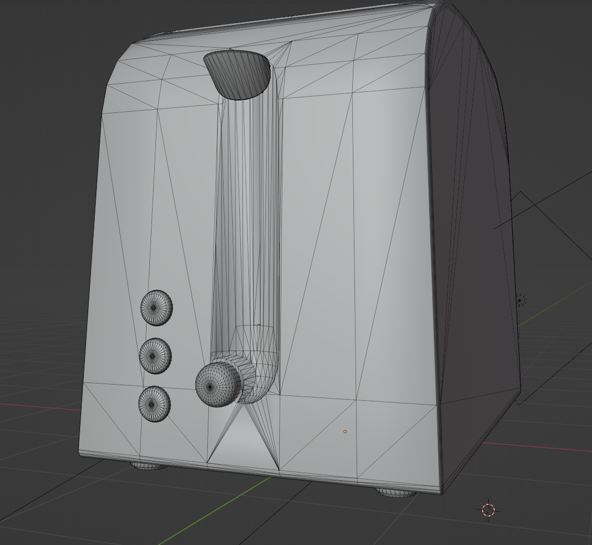

Next, if any parts of a model are very thin or made out of a plane, they are solidified to avoid issues with culling.


If a model had issues that could not be resolved then they were partially remade with more straight forward geometry. For example, the lower cabinets. Any additional models can be found in `Interactive/Additional_blender_models/`.

Then, since the light model used ([Phong lighting model](#phong-lighting-model)) does not support the complex material types possible in blender, any complex materials are made into a more simple version.


Here the glass and metal have been changed into more basic colours.


Now, all the materials for the object are baked into one texture for exporting. This is first done by adding an overall texture to each of the materials for the model.


Then the model is UV unwrapped to this texture, and any overlapping parts are fixed.


Next the texture is baked, without the overall lighting


Then this texture is applied to the model as a single material.


Next, any transformations are applied to the object.


Finally, the object is exported as a glTF file using the following settings.


### References

- Metallic texture - https://www.youtube.com/watch?v=YRKIAdMYcr0

- Texture baking
    - https://www.youtube.com/watch?v=Se8GdHptD4A
    - https://www.youtube.com/watch?v=B2kFeMBBBjc


### Upper Cabinet

First I changed the model into three meshes and baked the material for each object,
1: Back frame
2: Front frame with all the doors of cabinet except 1
3: 1 Remaining cabinet door

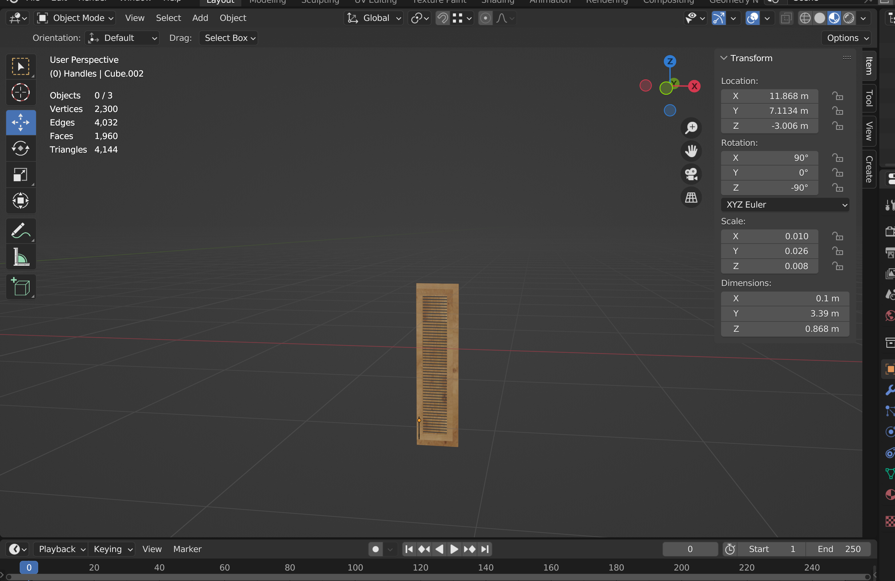
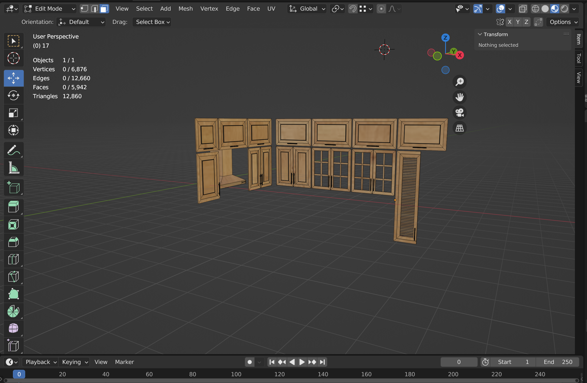
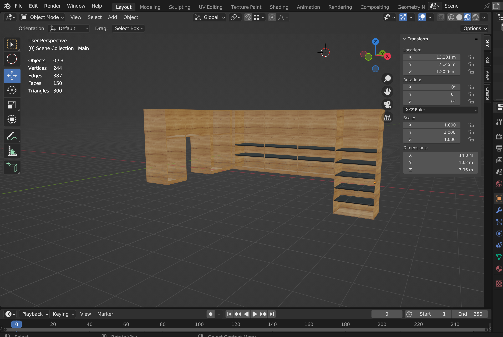

Then Exported all three meshes with gltf format and imported in the project and placed the models onto their correct place.
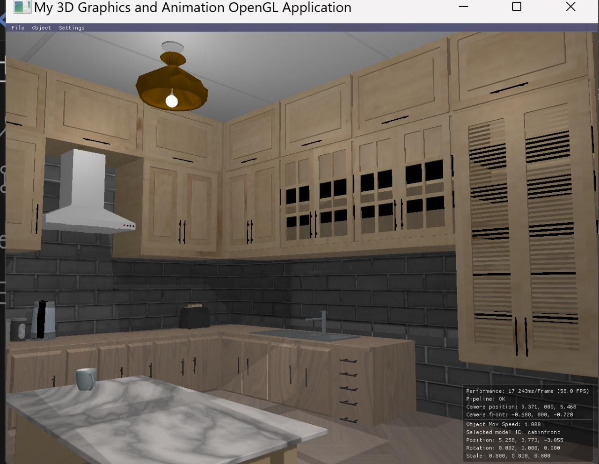


#### References

Baking and openGL documentation: as mentioned above.


### Plate

Used the early made plate from blender and then the texture are baked in for the plate 
,the image of baked on is given below 


Then the file exported as a .gltf file and then is transferred to the opengl 
,images inside the opengl is given below

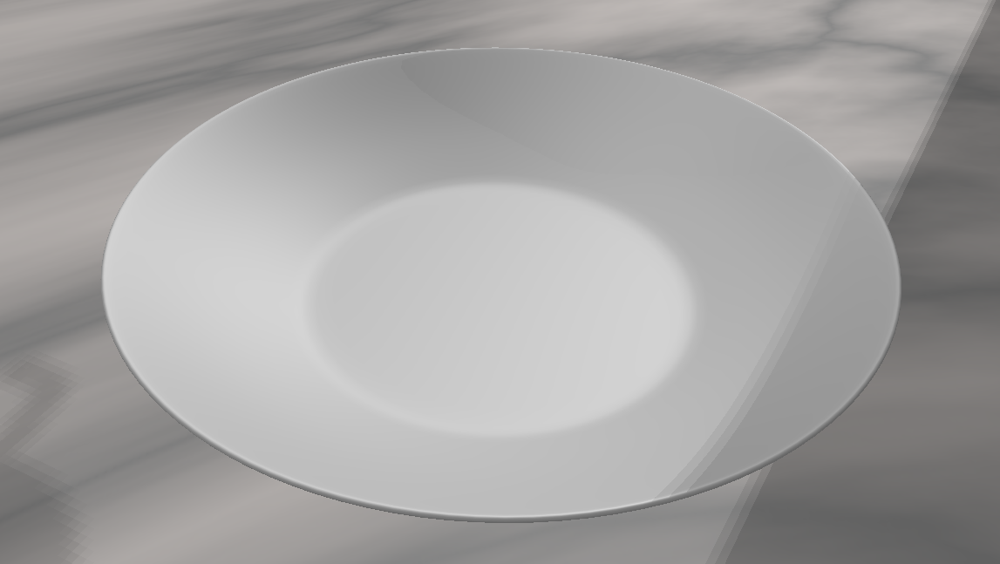

### Fridge 

Similar to the Plate fridge is also exported,
Export setting image is given below


The openGL image of the fridge is displayed below

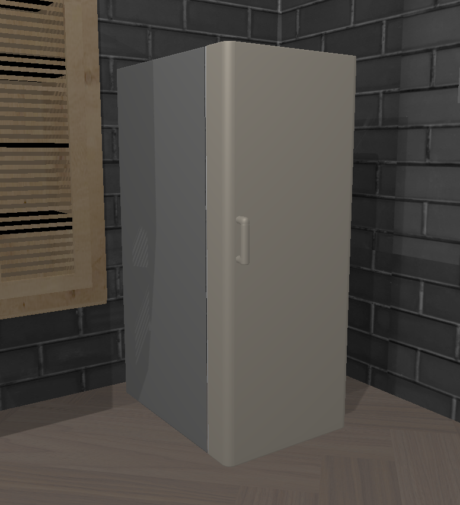


<br /><br />

## Scene Setup

### Model loading

Models are loaded in using the class `ModelObject`, which makes use of the provided `Content.cpp` & `Content.hpp` to load glTF files.


### Model placement

Once models had been loaded in, they were moved around the scene to position them. Some objects were not moved when imported, as they retained their relative positions in the blender scene, such as the walls, floor and roof.

The models can be moved with by selecting them with keyboard shortcuts and moving them, or through the UI. Once the model had been placed their coordinates were updated in the loading code.


### Light placement

Lights were placed in a similar way, using `LightObject` to set their basic properties. The light effect is then used to produce the scene [Shaders and Lighting](#shaders-and-lighting).


<br /><br />

## Shaders and Lighting

### Shaders

Shaders are loaded through the `ShaderObject` class, which makes use of the provided `Pipeline.hpp` & `Pipeline.cpp` classes to load and compile the shaders.

The main shaders are `vs_shadow_map.glsl` and `fs_shadow_map.glsl`. These have most of the light and shadow processing done in them, so objects that want to use these, use them.

There are also:

- `vs_light_basic.glsl` and `fs_light_basic.glsl` for basic light sources (light bulbs).
- `vs_simple_depth.glsl` and `fs_simple_depth.glsl` for creating depth maps - [Shadows](#shadows).
- `vs_stencil.glsl` and `fs_stencil.glsl` for object outlining - [Object highlights/outlines - Stencil Test](#object-highlightsoutlines---stencil-test).


### Phong lighting model

The main lighting model is the Phong lighting model. This model has a ambient, diffuse and specular component that are added together to find the lighting on each model. The implementation follows the Lecture 13 and _Advanced Lighting - Blinn-Phong_ from LearnOpenGL.

The lighting is extended to the Blinn-Phong, which improves the way the specular terms works.

The lightning is implemented through the user of shaders. The main shader that gives the lighting effect is the `fs_shadow_map.glsl` shader. This takes the parameters for the lights: 
- Light colour 
- Ambient constant
- Diffuse colour and constant
- Specular colour, constant and shininess.

These terms are then added together to produce the final effect.


#### References
- Lecture 13 - Light Models
- _Advanced Lighting - Blinn-Phong_ from LearnOpenGL by Joey de Vries -  https://learnopengl.com/Advanced-Lighting/Advanced-Lighting
- Specular highlight fix - https://stackoverflow.com/questions/61166762/opengl-phong-lighting-specular-highlight-is-wrong/61167359#61167359

### Attenuation

To reduce the effect of the lights the further away they are from an object (fragment), attenuation is used. This uses the light's position and fragment position to reduce the lighting on that fragment. This effect is combined with Blinn-Phong lighting mode, in the `fs_shsadow_map.glsl` shader.

```
 // Attenuation
float distance = length(lights[i].lightPosition - fs_in.FragPos);
float attenuation = 1.0f / (lights[i].atten_constant + lights[i].atten_linear * distance + lights[i].atten_quadratic * (distance * distance));

// Adjust values based on attenuation
ambient *= attenuation;
diffuse *= attenuation;
specular *= attenuation;
```

The attenuation constant, linear and quadratic terms come from the OGRE wiki table. These can be adjusted to change how strong the attenuation effect is.


#### References
- Lecture 14 - Advanced Lights
- _Light casters_ - from LearnOpenGL by Joey de Vries - https://learnopengl.com/Lighting/Light-casters
- OGRE Wiki - http://www.ogre3d.org/tikiwiki/tiki-index.php?page=-Point+Light+Attenuation

### Shadows

This section and code largely follows _Shadow Mapping_ from LearnOpenGL.

To produce shadows on objects, the scene is first rendered from the light's point of view to produce a depth map to find out of what it can and cannot see. Then a second normal render of the scene from the camera's view is done, combined with the light depth map to find which areas are in shadow.

To store the depth information, a new framebuffer and texture are created. This texture does not contain any colour information as we are only interested in the depth. This is done in `ShadowMap.cpp`.

The first pass through from the light's position uses the shaders `vs_simple_depth.glsl` and `fs_simple_depth.glsl`.

The second normal render makes use of the depth maps created in the first pass to change the colour on each fragment depending on how much light there is. This is done in the main shader, `fs_shsadow_map.glsl`. The way this is tested, is to see if the current fragment is the closest one to the light source, or if there is another one in the way.

The information is then combined with the [Phong lighting model](#phong-lighting-model) to produce the fragment colour.

```
vec3 lighting = (ambient + (1.0 - shadow) * (diffuse + specular));  
```

There are a few additional effects to correct for, one being "shadow acne". This is done by adding a bias term to slightly offset the depth.

To smooth the shadows out percentage-closer filtering (PCF) is used. This samples the fragments surrounding the current fragment to test if they are in shadow or not, then combines the results. This leads to softer looking shadows.

Lights can either be directional or non-directional. Directional lights use orthographic projection, which makes it appear as though the light comes from much further away than it's actual position.

Lights and their basic properties are set in `LightObject.hpp` and `LightObject.cpp`.
 
#### References

- _Shadow Mapping_ from LearnOpenGL by Joey de Vries - https://learnopengl.com/Advanced-Lighting/Shadows/Shadow-Mapping
- _Basic Shadow Mapping // Intermediate OpenGL Series_ from ogldev.org by Etay Meiri - https://www.youtube.com/watch?v=kCCsko29pv0

### Multiple lights and shadows

The light model is extended to work with multiple lights (and produce shadows for them) by rendering the scene once for each light to produce a depth map, then combining the light and shadow values in `fs_shsadow_map.glsl`. This is done by looping through each light, processing the information for the fragment and then adding them together to produce a final light term
```
for(int i=0; i < num_lights; i++) {

    [ Process each light's contribution ]

    totalLighting += lighting;
}
```
This does lead to the scene getting washed out with too many bright lights, so would be interesting to explore combining the light terms differently.


#### References
- Lab 06 - Lights and materials
- _Shadow Mapping_ from LearnOpenGL by Joey de Vries - https://learnopengl.com/Advanced-Lighting/Shadows/Shadow-Mapping
- _Modern OpenGL 08 – Even More Lighting: Directional Lights, Spotlights, & Multiple Lights_ - "Multiple Lights" section by Tom Dalling - https://www.tomdalling.com/blog/modern-opengl/08-even-more-lighting-directional-lights-spotlights-multiple-lights/ 


### Gamma

A gamma correction term can optionally be set to adjust the final lighting for the overall scene. This is again done in the `fs_shsadow_map.glsl` shader.

```
totalLighting = pow(totalLighting, vec3(1.0/gamma));
```

#### Refrences
- _Gamma Correction_ from Learn OpenGL by Joey de Vries - https://learnopengl.com/Advanced-Lighting/Gamma-Correction

<br /><br />


## Additional Effects

### Object highlights/outlines - Stencil Test

To highlight the currently selected object, it is possible to turn on object outlines. This is done by using a stencil test. The implementation for the stencil test heavily uses the code and information from [Stencil testing - learnopengl.com](https://learnopengl.com/Advanced-OpenGL/).

The stencil test is used to only write to the stencil buffer when an object we want to highlight is rendered. Once all these objects have been rendered, we use the data in the stencil buffer as a mask on areas not to overwrite, and render a slightly larger version of the model. Since this has the effect of giving the object an outline, that can also been seen through other objects.

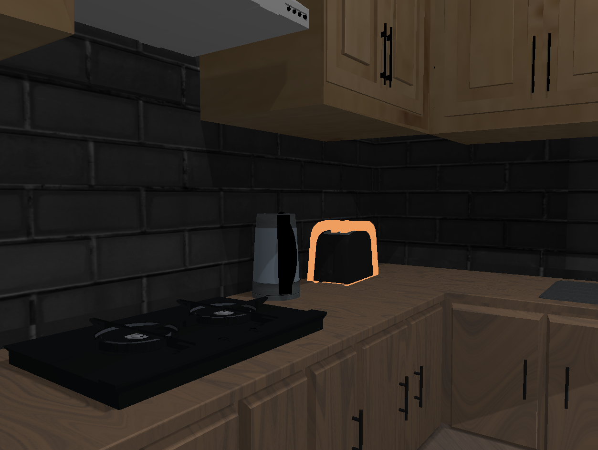

### Polygon Lines

Rendering normally or with polygon lines, by using OpenGL's rendering options.
```
if (showWireFrame) {
    glPolygonMode(GL_FRONT_AND_BACK, GL_LINE); // Draw lines
} else {
    glPolygonMode(GL_FRONT_AND_BACK, GL_FILL); // Draw normally
}
```

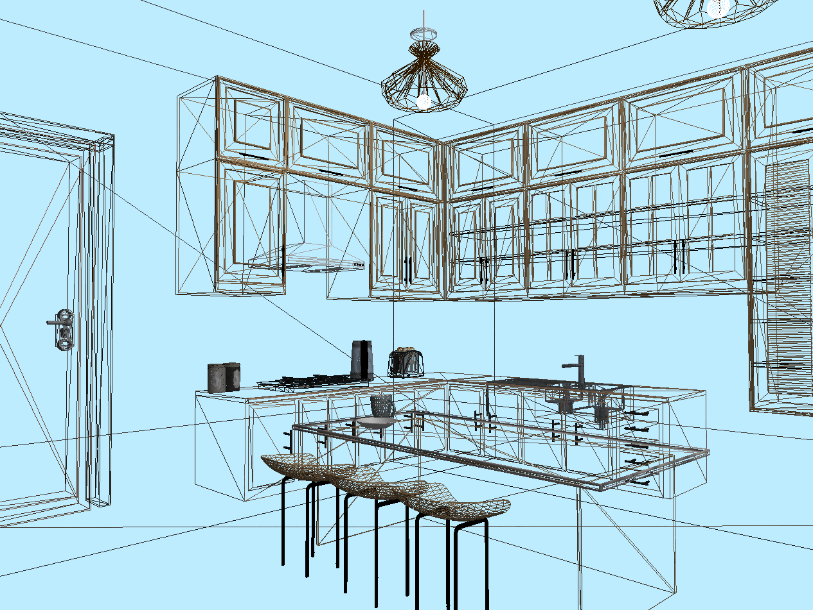


#### References

- _Stencil testing_ from Learn OpenGL by Joey de Vries - https://learnopengl.com/Advanced-OpenGL/Stencil-testing
- _OpenGL Tutorial 15 - Stencil Buffer & Outlining_ by Victor Gordan - https://www.youtube.com/watch?v=ngF9LWWxhd0


<br /><br />

## Interaction

### Camera

When the camera view matrix is called, it takes the camera position, front (what it is currently looking at) and up vector to produce a view matrix. 

```
glm::mat4 GetViewMatrix()
{
    return glm::lookAt(	Position,         // eye
                        Position + Front, // centre
                        Up);              // up
}
```

This can then be used to render the scene from the cameras point of view. When interacting with the camera (through the mouse and keyboard), both the potion and front are updated to produce a new view.

#### Camera - Mouse

The mouse and camera movement implementation follows a lot of the code in _Camera_ from Learn OpenGL. The camera direction is updated when the mouse is moved. This is done by using the amount the mouse has moved within the OpenGL window to calculate how far the camera has moved, updating the pitch and yaw. Then the new camera "front" direction is updated.

```
glm::vec3 front;
front.x = cos(glm::radians(yaw)) * cos(glm::radians(pitch));
front.y = sin(glm::radians(pitch));
front.z = sin(glm::radians(yaw)) * cos(glm::radians(pitch));

Front = glm::normalize(front);
```

##### References

- F21GA - Lab 05: Interaction, Cameras, Textures
- _Camera_ from Learn OpenGL by Joey de Vries - https://learnopengl.com/Getting-started/Camera

#### Camera - Keyboard

When one of the movement keys are pressed `W`, `A`, `S` and `D`, the new camera position (x, y, z) is first checked to see if it within the bounds of the movement are, and if so the camera position is updated.


### Keyboard

There are various key presses that produce effects within the Interactive OpenGL window. These are mostly shown in [Basic Interaction and Hotkey guide](#basic-interaction-and-hotkey-guide).


#### Light on/off


##### Screenshots

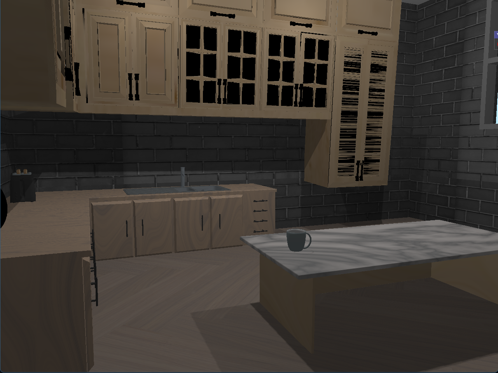
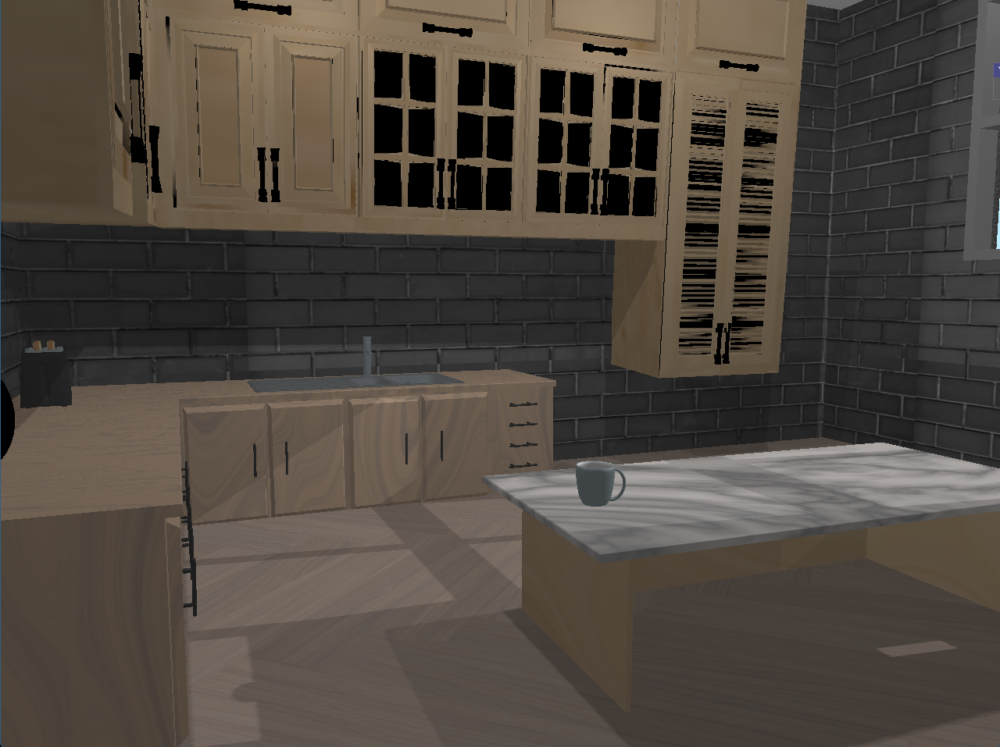


### UI

The UI is built using the [Dear ImGui](https://github.com/ocornut/imgui) library.

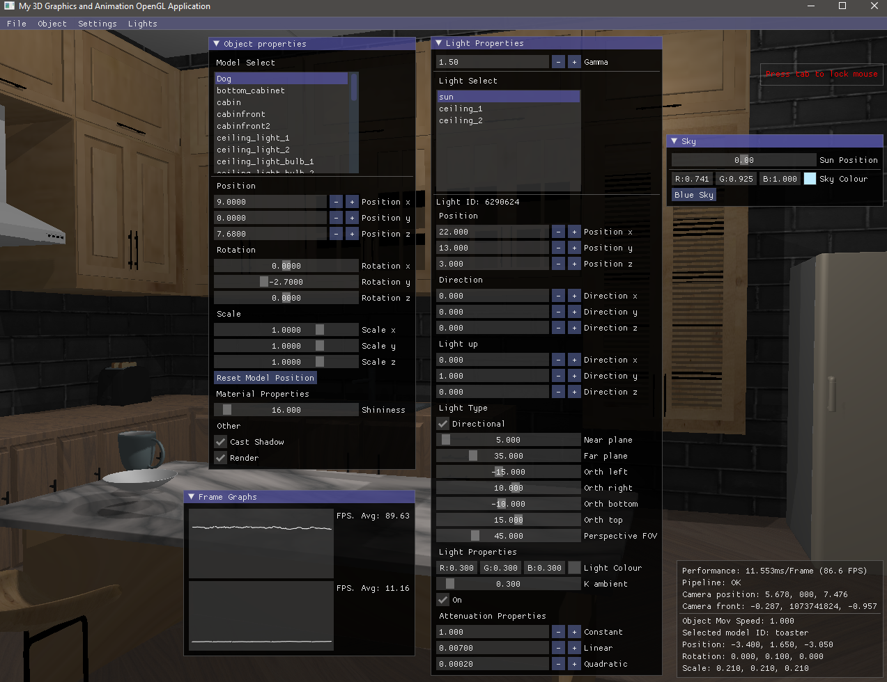

The UI has a main menu bar that accesses the other UI menu options.

There are menu for model selection and manipulation, as well as for light selection and manipulation.

There's information boxes for the frame time and FPS graphs. General camera and scene information is shown in the bottom right.

There are additional options for sun movement that tries to follow a curve to mimic time passing.


#### References
- [Dear ImGui](https://github.com/ocornut/imgui) by [@ocornut](https://github.com/ocornut)
- Interactive imgui_manual by Pascal Thomet [@pthom](https://github.com/pthom) - https://pthom.github.io/imgui_manual_online/manual/imgui_manual.html


## Animations

### Toast popping

_Chapter 22: Interpolation_ is used heavily for the toast movement.

The toast pop animation is done by using linear interpolation to move between two points (and rotations). The "key frames" for where the toast is an at what time are specified, then a lerp function is used to move between the two on each frame.

```
float BasicMovement::lerp(float x, float y, float t)
{
    return x * (1.f - t) + y * t;
}
```
The points and rotations are specified, then each frame the `Tick()` function is called to move the object along based on how much time has passed since the animation began.


### Storage Jar wobble

The storage jar animation is done in a similar way to [Toast popping](#toast-popping). However, there are a lot more points used in this animation, so it was more difficult to keep track of them. If given more time, a UI option to help plan points and timing would have been nice to implement.


### Cabinet door opening

Animation was added and interaction with cabinetfront 1. Upon selecting this object and pressing G will rotate open the door. But I was unable to specify the direction of the animation.

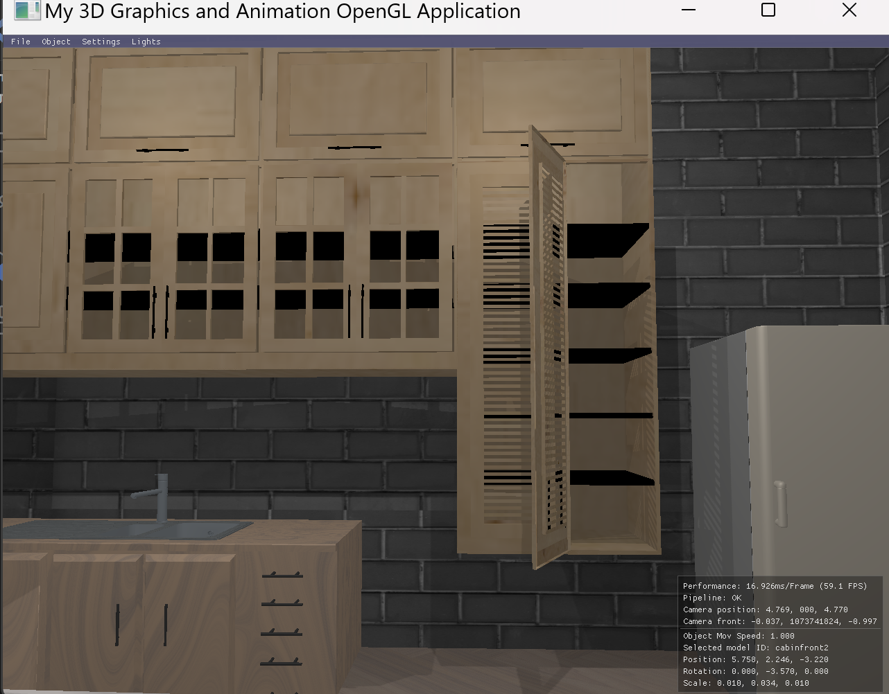

### References
- _Chapter 22: Interpolation_ from Graphics Programming Compendium by Ian Dunn and Zoë Wood - https://graphicscompendium.com/opengl/22-interpolation


<br /><br />

## References

Extensive use was made of LearnOpenGL by Joey de Vries - https://learnopengl.com/ 

