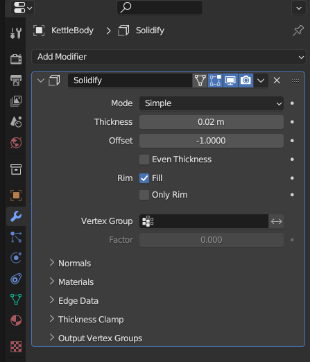
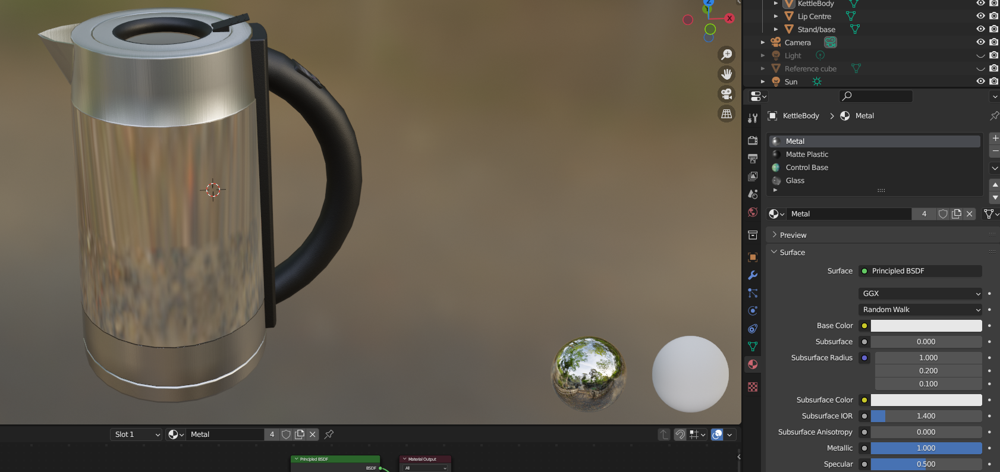
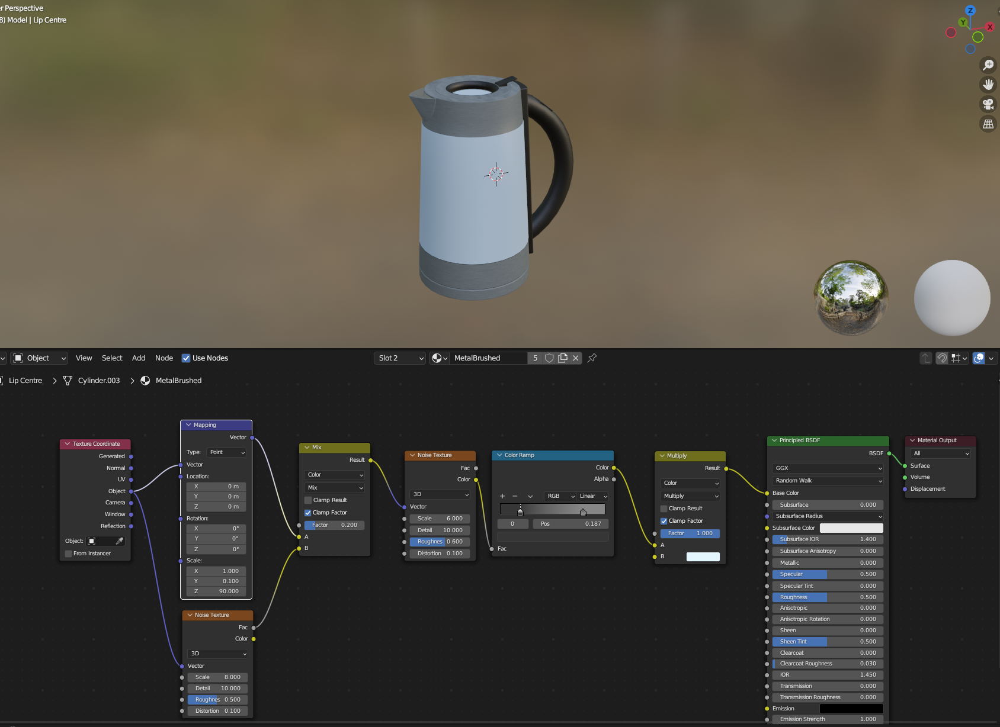
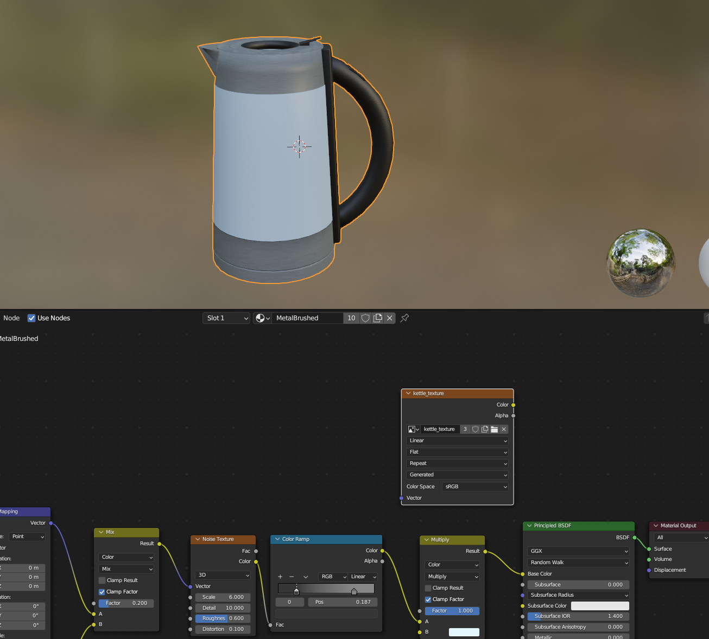
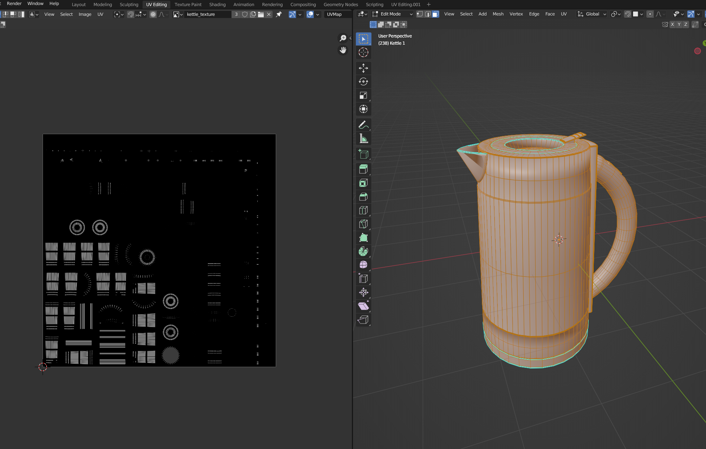
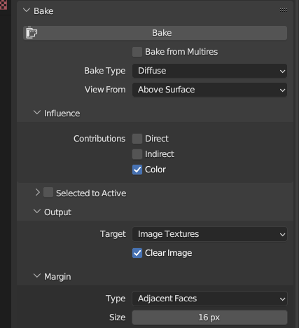
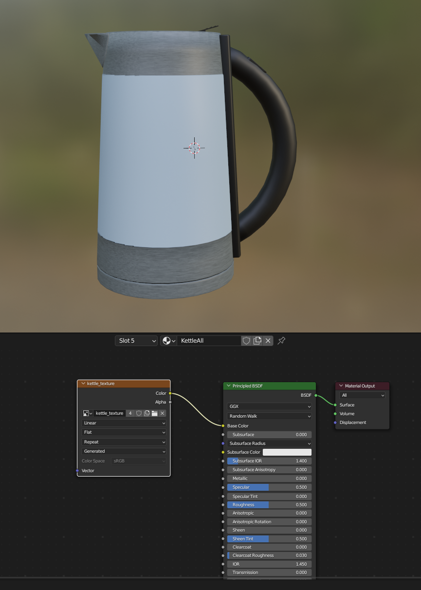
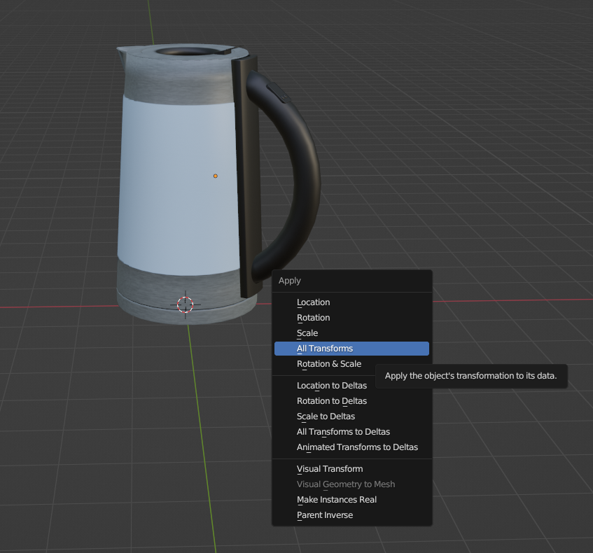
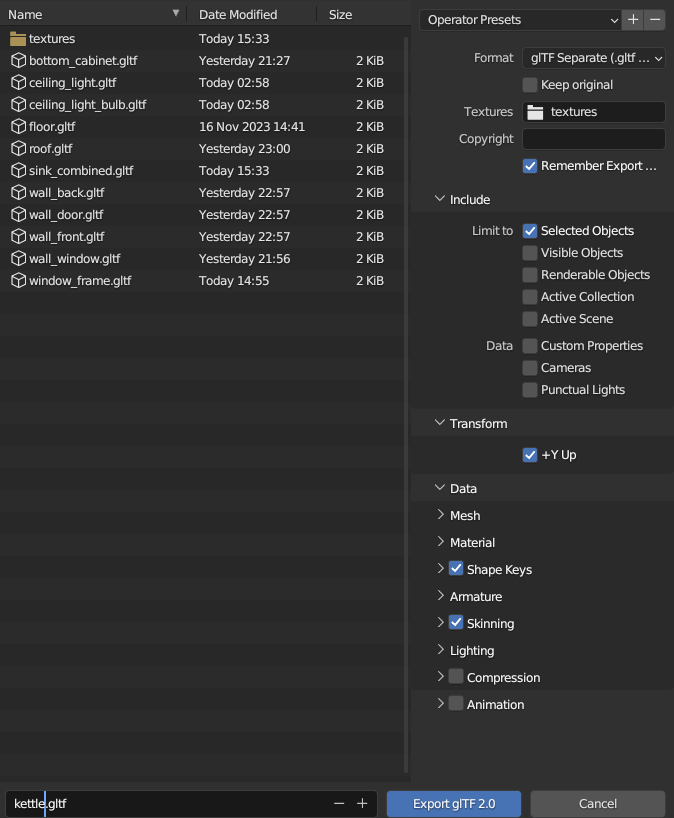

# F21GA - Interaction

## Contents

- [Model Exporting and Importing](#model-exporting-and-importing)

- [Scene Setup](#scene-setup)

- [Shaders and Lighting](#shaders-and-lighting)

    - [Phong lighting model](#phong-lighting-model)
    - [Attenuation](#attenuation)
    - [Shadows](#shadows)
    - [Multiple lights and shadows](#multiple-lights-and-shadows)

- [Additional Effects](#additional-effects)

- [Interaction](#interaction)
    
    - [Mouse](#mouse)
    - [Keyboard](#keyboard)
    - [UI](#ui)

- [References](#references)

## Model Exporting and Importing

The basic steps to import most of the models are as follows.

First, if any parts of a model are very thin or made out of a plane, they are solidified to avoid issues with culling.

Next, since the light model used ([Phong lighting model](#phong-lighting-model)) does not support the complex material types possible in blender, any complex materials are made into a more simple version.

Here the glass and metal have been changed into more basic colours.

Now, all the materials for the object are baked into one texture for exporting. This is first done by adding an overall texture to each of the materials for the model.

Then the model is UV unwrapped to this texture, and any overlapping parts are fixed.

Then the texture is baked, without the overall lighting

Then this texture is applied to the model as a single material.

Next, any transformations are applied to the object.

Then the object is exported as a glTF file using the following settings.

  

## Scene Setup

Model placement, light placement?

  

## Shaders and Lighting

### Phong lighting model

### Attenuation

### Shadows

### Multiple lights and shadows

  

## Additional Effects

Other framebuffer effects or techniques?

  

## Interaction

### Mouse

### Keyboard

### UI

  

## References

Any other references / reference summary