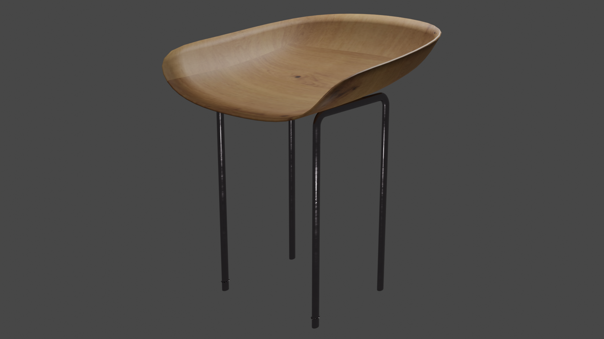
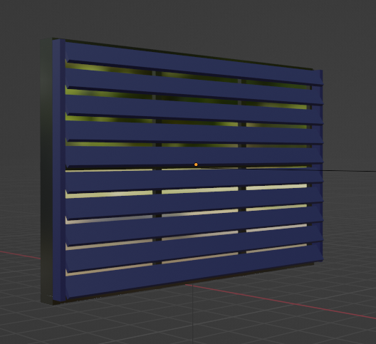

# F21GA - Render

## Contents

- [Kitchen Scene](#kitchen-scene)
- [Models](#mod)
    - [Bottle](#bottle) : @guillotcyril
    - [Ceiling Light](#ceiling-light)
    - [Chairs](#chairs) : @devJudah
    - [Cooker](#cooker)
    - [Cup](#cup) : @devJudah
    - [Dish](#dish) : @devJudah
    - [Door](#door) : @guillotcyril
    - [Dustbin](#dustbin)
    - [Fridge](#fridge) : @devJudah
    - [Kettle](#kettle) : @nd-103
    - [Lower Cabinet](#lower-cabinet)
    - [Sink](#sink) : @nd-103
    - [Storage Jars](#storage-jars) : @nd-103
    - [Table](#table) : @devJudah
    - [Toaster](#toaster) : @nd-103
    - [Upper Cabinet](#upper-cabinet)
    - [Walls, ceiling and floor](#walls-ceiling-and-floor) : @guillotcyril
    - [Window](#window) : @guillotcyril
- [Final Scene](#final-scene)

---

## Kitchen Scene

### Concept Pictures

The initial idea for the kitchen scene.

From [3D Kitchen Model D scene](https://www.turbosquid.com/3d-models/3d-kitchen-model-d-scene-2120856).

  

## Models

### Bottle

#### Reference image

 

#### Modelling process

 

#### Rendered image

 

  

### Ceiling Light
(Aswin Shaji)
### Modeling Image
 

### Rendered image

  

### Chairs
#### Reference images

  

#### Modelling process

  

  

#### Rendered Image

  

### Cooker
(Aswin Shaji)

  

### Cup

#### Reference images

  

#### Modelling process

  

  

  

  

  

  

  

  

#### Rendered Image

  

### Dish
#### Modelling process

  

  

  

  

  

  

  

#### Rendered Image

  

### Door
#### Reference images

#### Moddeling process

#### Rendered image

#### Handle
##### Reference images

#### Moddeling process

  

### Dustbin
(Aswin Shaji)

#### Modeling Screenshot images

  

### Fridge

#### Reference images

#### Modelling process

  

#### Rendered Image

  

### Kettle
(Nick Diamond)

#### Reference images

#### Modelling process

Body of the kettle made first.

Then the handle & spout.

Next, the base and lid.

First attempt at material.

Second attempt at material & texture.

Final version.

#### References
- Metalic material: https://www.youtube.com/watch?v=8D4exODUKmk
- Glass material: https://www.youtube.com/watch?v=CtfNtpJa3hU
- Clear plastic material: https://www.youtube.com/watch?v=PKwKT-tvu5E
- Matte plastic material: https://www.youtube.com/watch?v=Wd494AmpGDI

#### Render

A render of the kettle only. Using cycles and 200 samples.

  

### Lower Cabinet
(Aswin Shaji)

  

### Sink

(Nick Diamond)

#### Reference images

#### Modelling process

Main body of the sink.

Plugs.

Tap & materials.

Geometry fix (on the "insets" in the sink)

Overflow

#### References
- Metalic material: https://www.youtube.com/watch?v=8D4exODUKmk

#### Render

A render of the sink only. Using cycles and 200 samples.

  

### Storage Jars

(Nick Diamond)

#### Reference images

#### Modelling process

Inital jar body.

Jar lid.

Jar window/see through plastic. Added materials.

Final jar. Created a silver & black version

#### References
- Metalic material: https://www.youtube.com/watch?v=8D4exODUKmk
- Clear plastic material: https://www.youtube.com/watch?v=PKwKT-tvu5E

#### Render

A render of the jars only. Using cycles and 200 samples.

  

### Table

#### Modelling process

#### Rendered Image

  

### Toaster

(Nick Diamond)

#### Reference images

#### Modelling process

Inital attempt at toaster body.

Improved toaster cutout, and added buttons.

Added toaster handle/lever.

Added toaster textures & materials.

#### References
- Metalic material: https://www.youtube.com/watch?v=8D4exODUKmk
- Matte material: https://www.youtube.com/watch?v=Wd494AmpGDI

#### Render

A render of the toaster only. Using cycles and 200 samples.

  

### Upper Cabinet

#### References
- Wood texture: https://www.youtube.com/watch?v=Egd_BNAT3l8
- Glass texture: https://www.youtube.com/watch?v=jrus-PQZGLk
#### Render

  

### Walls, ceiling and floor
- Marble texture tutorial : https://www.youtube.com/watch?v=jlVrs83wsek
- Brick texture tutorial : https://www.youtube.com/watch?v=2MxQUaMlk3A
- Brick texture tutorial : https://www.youtube.com/watch?v=Hl8nfblJNF8

  

### Window

#### References
- Transparent glass material :  https://blender.stackexchange.com/questions/223624/glass-bsdf-gets-totally-grey-white-in-cycles

#### Reference images

#### Moddeling process

#### Rendered image

  

## Final Scene

### Lighting
The main light source was a "sun" light, implemented using the [Sun Position](https://docs.blender.org/manual/en/latest/addons/lighting/sun_position.html) addon. 

Both the ceiling lights have a spot light. 

There are some area lights under the upper cabinets. To give a little bit more light to the worktop area.

There are also some area lights around the cooker hood.

### Render settings

The image is rendered at a resolution of 1920x1080.
The scene was rendered using cycles (4096 samples).

### Renders

